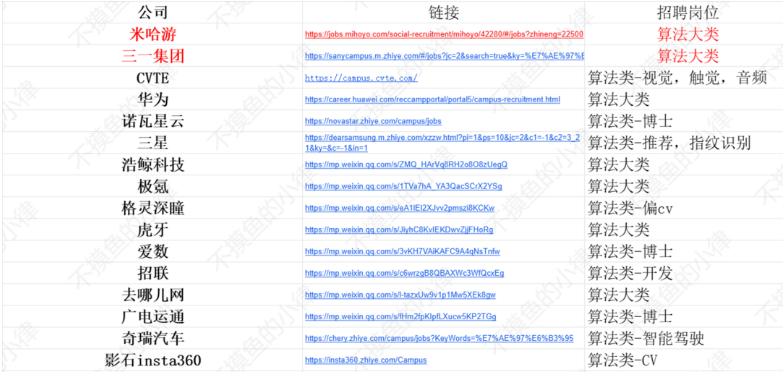
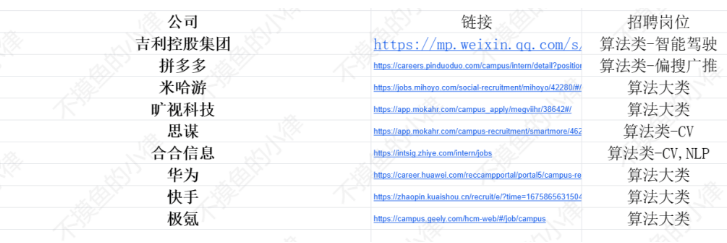

# [全网最全]23届&24届算法工程师招聘信息汇总

**本文为正在23，24届求职算法工程师的同行们准备~**

先自己介绍一下，我是23届秋招幸运上岸某独角兽厂的算法工程师。回想起去年，自己边实习，边打比赛，边写论文，熬了不知道几个夜，只为让简历更好看一点。

但这些还不算完，简历好看了没用，咱还得去投啊，那又得花大量时间去找招聘公司的信息，虽然有人整理了一些，但是他们整理的都是互联网大类，我还是要一个个点进去去找，看哪些公司有符合我的岗位，这又要花很长的时间，而且因为实习的关系，找公司，投递简历一般都是在晚上和周末，很浪费时间，每次一找就是一个晚上一个下午的时间，这些时间去刷刷力扣不香吗，但是没办法，没有专门的算法工程师岗位投递信息。

**所以，我来了！趁着自己现在已经毕业，又还没入职的间隙，我为正在求职的各位整理了各大公司的算法工程师招聘汇总！！**

**我的excel表只统计算法工程师方向的工作！参考了大部分线上文档，整理出来的算法工程师春招信息，也有部分24届暑假实习的信息！为各位求职算法工程师的同行节省更多的时间！**

部分截图如下，招聘岗位的内容是我按自己的理解写的，算法大类就是指这个公司招的岗位较多，推荐每个都点进去看看，说不定就有你的菜！招的不多的我会直接在-后面写出来，这样就省了大家的时间！

先奉上宝贵的链接：（如有遗漏，欢迎补充~）

[【全网最全】23届&24届算法工程师招聘汇总](https://docs.qq.com/sheet/DTHFZQ2xBUEJqck5F?tab=BB08J2&u=66013032f3754b3882b8330869e9ce2b)**(长期更新)**

**现在已录入100+家公司的算法工程师招聘信息，总有一些你没投过的！抓住信息差~**

以下是还有部分暑假实习已开放公司

**24届暑假实习一般三月初正式开始，现在只有少量，但是大家也可以先关注起来呀~关注这个文档，加群一起备站暑假实习，分享学习资料！有问题也可以直接问我（恬不知耻装学长）！**

咱只是小个体，所以群里人也不会多，平时还可以吹吹牛，说不定以后就是人脉了~

**最后，欢迎关注下方公众号，第一时间知道最新信息！分享，转发给身边的同门！一起备战今年的求职季！**

**如果各位有简历问题，分享，转发之后，也可以让本人修改一下简历哈，争取从陌生人/面试官角度修改你的简历~**

